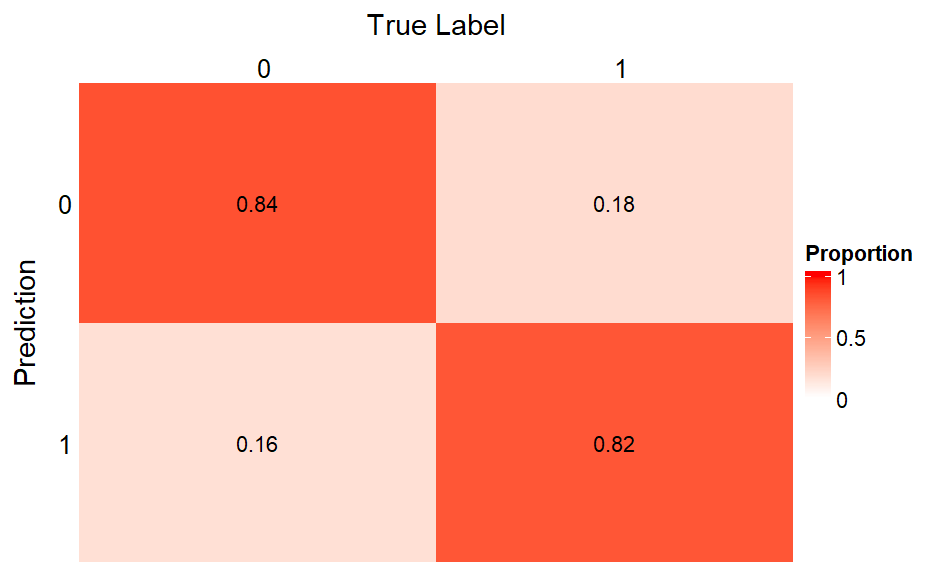
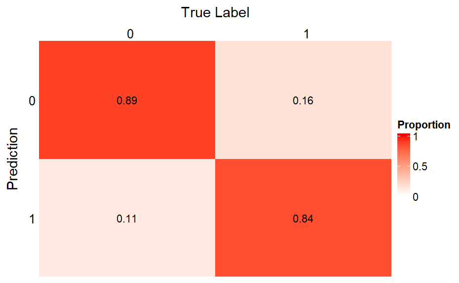

Instructions: 

Summarize results in Rmarkdown document, submitted separately from the R package. Aim for Introduction to the dataset and the question, a Methods section with any important pre-processing etc., three sections of Results (which may also contain some method details), and Discussion about interpretation or possible future directions.

R package and Rmd details:

R package and Rmd file should be runnable by instructors (unless data has privacy restrictions, in which case we can arrange an exception). Analyses are contained in Rmd file itself and should not reside in the R package.  The R package will be turned in separately as part of your group repository, and your Rmd file should utilize the R package. Your Rmd should start by loading your package. You can point out where to download data, you don’t necessarily need to contain in a data/ directory in the package, especially if it very large. The R package should have man pages for any functions that are exported. The R package should pass build/check as shown in class (ask if you have questions about this).

```{r, include = F}
library(devtools)
library(knitr)
library(tidyverse)
library(dplyr)
library(car)
library(pROC)
library(ComplexHeatmap)
library(circlize)
library(grid)
library(MASS)
library(ggplot2)
```

```{r}
# load R package
load_all("heaRt")
```

# 1 Introduction
Clear background on problem to be addressed given
Question(s) to be explored, discussed, and learned
Brief description of data/characteristics, how it relates to addressing question(s)

## 1 (i) Background
Heart disease is a leading cause of death in the United States, accounting for over 700,000 deaths each year and posing a significant healthcare burden [1]. Accurate and early detection of heart disease is essential for improving patient outcomes, with implications for treatment plans, medication strategies, and lifestyle modifications. Traditional diagnostic methods, such as stress testing and electrocardiography (ECG), provide detailed, valuable insights of possible signals for the presence of heart disease. Thus, integrating this data together can enhance heart disease identification. The objective of our project is to develop a data-driven approach to predict the presence or severity of heart disease.

## 1 (ii) Data
To accomplish this objective, we will analyze a publicly available dataset collected by the Cleveland Clinic between 1981 and 1984. This dataset includes 303 patients with or without heart disease, and includes a variety of their demographic features (e.g. age and sex) and clinical features (e.g. resting blood pressure, serum cholesterol, chest pain, and response to exercise) on which to train a predictive model. Specifically, the heart disease outcome of interest is a categorical value with 0 being no heart disease and 1 to 4 being increasing heart disease severity. In our analysis we will use both the full outcome spectrum (0-4) and a simplified, binary outcome of 0 (no heart disease) and 1 (heart disease, any severity). The link to the dataset repository is found here: https://doi.org/10.24432/C52P4X. In addition to the age and sex demographic variables, the table below provides more information on the clinical variables available in the dataset.

```{r, echo=FALSE}
var_table <- data.frame(
  Variable = c("cp", "trestbps", "chol", "fbs", "restecg", "thalach", 
               "exang", "oldpeak", "slope", "ca", "thal"),
  Name = c(
    "Chest Pain Type", 
    "Resting BP", 
    "Serum Cholesterol", 
    "Fasting Blood Sugar > 120 mg/dl", 
    "Resting ECG Results", 
    "Max Heart Rate Achieved", 
    "Exercise Induced Angina", 
    "ST Depression Induced by Exercise", 
    "Peak Exercise ST Segment Slope", 
    "Number of Major Vessels Colored by Fluoroscopy", 
    "Thallium Stress Test Result"
  ),
  Type = c(
    "Categorical", 
    "Integer", 
    "Integer", 
    "Categorical", 
    "Categorical", 
    "Integer", 
    "Categorical", 
    "Integer", 
    "Categorical", 
    "Integer", 
    "Categorical"
  ),
  Explanation = c(
    "Typical angina, atypical angina, non-anginal pain, or asymptomatic",
    "In mm Hg on admission to the hospital",
    "Elevation associated with heart disease",
    "1 = true; 0 = false. Elevation is associated with heart disease",
    "Normal, having ST-T wave abnormality, or showing probable/definite left ventricular hypertrophy by Estes' criteria",
    "During exercise",
    "1 = yes; 0 = no",
    "Commonly presents in ischemia. The deeper and earlier the depression during exercise, the higher the likelihood of obstructive coronary disease",
    "Upsloping, flat, or downsloping. Flat or downsloping ST segments more often associated with coronary artery disease",
    "Appearing to contain calcium deposits; marker of atherosclerosis and higher CAD disease",
    "3 = normal; 6 = fixed defect (scar tissue from prior heart attacks); 7 = reversible defect (impaired blood flow during stress, normal at rest). Radioactive tracer shows blood flow in heart muscle"
  )
)


kable(var_table, caption = "Clinical variables available in the dataset.")
```

# 2 Methods
Explanation of key data preprocessing/wrangling steps (if any) + rationale
Clear description of Module 2 likelihood based methods used, with the following
	Likelihood/objective function
	Estimation procedure/hypothesis testing approach (if relevant)
	Motivation for use and justification, assumptions
Discussion of Module 3 machine learning method used
	Justification for use
	Discussion of tuning parameter/hyper parameter selection strategy
Metrics for performance comparison between proposed models 
All specialized methods should leverage R package (should be loaded first)
	Functions used from package should be briefly described

## 2 (i) Data Preprocessing
For categorical variables, we applied one-hot encoding to convert each category into a separate binary indicator variable. After this transformation, the full model included a total of 20 predictor variables. To address potential overfitting and improve model parsimony, we employed stepwise selection based on the Akaike Information Criterion (AIC). This approach iteratively added or removed predictors to identify a subset of variables that provided the best balance between model fit and complexity, ultimately selecting a more streamlined and interpretable model for subsequent analysis.

## 2 (ii) Logistic Regression Model
Logistic regression is a widely used statistical model for predicting a binary outcome based on a set of predictor variables. The model assumes that the log-odds of the probability of the outcome is a linear function of the predictors. Specifically, if $Y$ is a binary outcome taking values in $ \{0,1\} $ and $ \mathbf{x} $ is a vector of covariates, then the logistic regression model is given by:
$$
\log\left( \frac{\Pr(Y=1|\mathbf{x})}{\Pr(Y=0|\mathbf{x})} \right) = \mathbf{x}^\top \boldsymbol\beta
$$
where $ \boldsymbol\beta $ is the vector of regression coefficients to be estimated. The corresponding probability model is:
$$
\Pr(Y=1|\mathbf{x}) = \frac{1}{1+\exp(-\mathbf{x}^\top \boldsymbol\beta)}
$$

To estimate the coefficients $ \boldsymbol\beta $, maximum likelihood estimation is employed. The likelihood function for a sample of size $n$ is:
$$
L(\boldsymbol\beta) = \prod_{i=1}^n \left( \frac{1}{1+\exp(-\mathbf{x}_i^\top \boldsymbol\beta)} \right)^{y_i} \left( \frac{\exp(-\mathbf{x}_i^\top \boldsymbol\beta)}{1+\exp(-\mathbf{x}_i^\top \boldsymbol\beta)} \right)^{1-y_i}
$$
and the log-likelihood function is:
$$
\ell(\boldsymbol\beta) = \sum_{i=1}^n \left( y_i \mathbf{x}_i^\top \boldsymbol\beta - \log\left(1+\exp(\mathbf{x}_i^\top \boldsymbol\beta)\right) \right)
$$

Because there is no closed-form solution for $ \boldsymbol\beta $ that maximizes the log-likelihood, iterative numerical methods must be used. One of the most common algorithms for this purpose is the Newton-Raphson method.

The Newton-Raphson method is a second-order optimization technique that updates the parameter estimates iteratively. At each iteration $k$, given a current estimate $ \boldsymbol\beta^{(k)} $, the next estimate $ \boldsymbol\beta^{(k+1)} $ is obtained by:
$$
\boldsymbol\beta^{(k+1)} = \boldsymbol\beta^{(k)} - \left( \nabla^2 \ell(\boldsymbol\beta^{(k)}) \right)^{-1} \nabla \ell(\boldsymbol\beta^{(k)})
$$
where $ \nabla \ell(\boldsymbol\beta^{(k)}) $ is the gradient (score function) and $ \nabla^2 \ell(\boldsymbol\beta^{(k)}) $ is the Hessian matrix (second derivative of the log-likelihood).

In logistic regression, the gradient and Hessian have specific forms. The gradient is:
$$
\nabla \ell(\boldsymbol\beta) = \sum_{i=1}^n (y_i - \pi_i) \mathbf{x}_i
$$
where $ \pi_i = \Pr(Y=1|\mathbf{x}_i) $, and the Hessian is:
$$
\nabla^2 \ell(\boldsymbol\beta) = -\sum_{i=1}^n \pi_i (1-\pi_i) \mathbf{x}_i \mathbf{x}_i^\top
$$

Thus, each Newton-Raphson update involves solving a linear system based on the weighted sum of the covariates. The iterations continue until convergence, usually when the change in $ \boldsymbol\beta $ is smaller than a pre-specified tolerance.

In our model, we set the initial $\boldsymbol\beta$ as 0, tolerance as $10^{-3}$ and iterative times as $10^3$.

## 2 (iii) Proportional Odds Cumulative-Logit Model (POLR)
Although a binary classification model such as logistic regression can be easy to interpret, making use of all available categories in our response variable may help us with better prediction, or provide better interpretability/insight clinically. Given that our response variable is ordinal in nature, a proportional odds cumulative-logit model seemed ideal to preserve interpretability and simplicity. 

This approach models the logit of the cumulative probabilities as a linear combination of an intercept (unique to each category) and the covariates of the model. This can be written out as follows:

$$logit(P(Y \le j) = \theta_j + X\beta + \epsilon$$
where, $\epsilon \sim N(0, \sigma^2)$, $\beta$'s are the fixed coefficients, and the $\theta$'s refer to an intercept pertaining to each category. 

This model measures how likely the response is to be in category j or below versus in a category higher than j. Given that $P(Y \le k) = 1$ when there are k categories, we do not need a coefficient $\theta_k$. Thus, we will have $k-1$ intercepts and $p$ beta coefficients to estimate in our model, where $p$ is the number of covariates in our model including the intercept.

Notice in our model that the intercepts can differ but that the slope stays the same regardless of the change in the response category. This comes from our proportional-odds assumption. 
To estimate our parameters from this model, we use the BFGS algorithm. This is laid out in the next section.

### Estimation: using BFGS to estimate POLR parameters

The BFGS algorithm requires the use of the objective (log-likelihood) function and the first derivative of it to go about the optimization process. As the user, we do not need to input second derivatives but the method will approximate the Hessian matrix. Our initial plan was to use Newton Raphson (NR) instead, but the complexity of the 2nd derivative (Hessian) prompted us to use BFGS instead. The updating equation for BFGS can be written out as follows (assuming \alpha refers to the parameter space):

$$\alpha^{(t+1)} = \alpha^{(t)} - (M^{(t)})^{-1}f^{'}(\alpha)$$

where, $M^{(t)}$ is the matrix that approximates the Hessian. Quasi-newton methods (such as that laid our below) are used to approximate the Hessian matrix. The update to the approximated Hessian matrix can be written out as follows:

$$M^{(t+1)} = M^{(t)} - \frac{M^{(t)}z^{(t)}(M^{(t)}z^{(t)})^{T}}{(z^{(t)})^{T}M^{(t)}Z^{(t)}} + \frac{y^{(t)} (y^{(t)})^{T}}{(z^{(t)})^{T}y^{(t)}} + \delta^{(t)} (z^{(t)})^{T}M^{(t)}z^{(t)}d^{(t)}(d^{(t)})^{T} $$ 
where, 

$$d^{(t)} = \frac{y^{(t)}}{(z^{(t)})^{T}y^{(t)}} - \frac{M^{(t)}z^{(t)}}{(z^{(t)})^{T}M^{(t)}z^{(t)}}$$

where, 

$$z^{(t)} = \alpha^{(t+1)} - \alpha^{(t)}$$
and,

$$y^{(t)} = f^{'}(\alpha^{(t+1)}) - f^{'}(\alpha^{(t)})$$
The above class of algorithms is indexed by $\delta^{(t)}$ and when $\delta^{(t)} = 0$, this update is the BFGS update. 

Whilst we coded up the log-likelihood and the first derivative by hand, we did not derive the BFGS algorithm from scratch. The optimx function from the optimx package on R was used for the optimization step. The steps used to derive the estimates using BFGS is given below:

#### Derive log-likelihood function

$$ll = \sum_{i=1}^{n} \sum_{j=1}^{J}I(y_{i} = j) log[\frac{1}{1 + exp(-(\theta_j - x_{i}^{T}\beta))} - \frac{1}{1 + exp(-(\theta_{j-1} - x_{i}^{T}\beta))}]$$
where, $I(y_{i} = j)$ is the indicator function indicating if a response is category $j$ or not. Each individual $i$ contributes only to one category. 

Here, we can see that the 2 terms within log are Cumulative Distribution Functions (CDFs) related to the logistic function. For ease in the next steps we can denote these two terms as $F_j$ and $F_{j-1}$ respectively. Let's also denote $\pi_{ij} = F_j - F_{j-1}$

#### Derive the score function (first-derivative)

The score function can be written as,

$$
f^{'}(\theta) = \begin{pmatrix}
\frac{\partial{ll}}{\partial{\beta}}   \\
\frac{\partial{ll}}{\partial{\theta_j}}
\end{pmatrix}
$$

We first show the first-derivative w.r.t. $\beta$.

$$\frac{\partial{ll}}{\partial{\beta}} = \sum_{i=1}^{n} \sum_{j=1}^{J} I(y_{i} = j) \frac{f(t_{j-1}) - f(t_j)}{\pi_{ij}} x_i$$
where, $f(t_{j-1}) = f(\theta_j - \eta_i)$ the pdf of the logistic function at $(\theta_j - \eta_i)$, $\eta_i = x_i\beta$

We now show the first-derivative w.r.t. $\theta_j$. The derivative for the rest of the categories follow the same form.

$$\frac{\partial{ll}}{\partial{\theta_j}} = \sum_{i=1}^{n} I(y_{i} = j) (\frac{f(t_k)}{\pi_{ik}} - \frac{f(t_k)}{\pi_{i, k+1}})$$
Note that each $i$ will contribute to only one partial derivative calculation.

Substituting the log-likelihood and the first derivative functions to optimx, we can obtain the parameter estimates for both the $\beta$'s and the $\theta_j$'s. BFGS requires initialization of the parameters.

### Initialization of parameters

The $\beta$ coefficients were all initialized at $0$ (including the intercept), whilst the $\theta$ intercepts were initialized empirically. In further detail, the $\theta_j$'s were initialized as follows:

Step 1: Find the cumulative probabilities $P(Y \le j)$ for $j = 1,...,5$.

Step 2: Find the quantiles of these cumulative probabilities in a logistic distribution. 

These quantiles are which were used as the initial estimates. The rationale behind using this was (i) to make use of the data at hand, and (ii) to take into account the relationship between the $\theta_j$'s and the cumulative probabilities. 

We did not try different initializations because (i) the algorithm converged very fast,  and (ii) the output from using this approached matched with that produced by the 'polr' function by R. 


### Class prediction

Once we estimate the parameters laid out in our model, we perform class prediction. This was done as follows:

Step 1: Obtain the $\theta_j$ intercepts as laid out above. 

Step 2: Now predict the class. Let $c$ be the predicted class, and $P(Y_{i} < j)$ be the estimate of the probability of individual $i$'s category being $\le j$.

$$
c =
\begin{cases}
  0, & P(Y_{i} \le 0) \le \theta_j \\
  1, & \theta_0 \le P(Y_{i} \le 1) \le \theta_1 \\
  2, & \theta_1 \le P(Y_{i} \le 2) \le \theta_2 \\
  3, & \theta_2 \le P(Y_{i} \le 3) \le \theta_3 \\ 
  4, & P(Y_{i} \le 4) \ge \theta_3 \\
\end{cases}
$$
Once prediction has been carried out as above, heatmaps in the form of a confusion matrix was derived for both the training and test data. 

In addition to this, we used (i) misclassification distance, (ii) accuracy, (iii) weighted Kappa score (with quadratic weights) metrics to measure model performance in both the training and test data. 

The weighted Kappa score holds a similar definition to that in the binary framework. This score assigns different weights to the disagreements between predicted and observed values based on the magnitude of the disagreement.

As a step further to what was laid out above, we also looked into model performance after collapsing categories $1-4$ to one category. That is, we dichotomized our outcome and then looked at model performance. Model performance was measured using exactly the same three metrics used for POLR. 

### Model Selection

One last procedure that was conducted in our analysis was that of model selection using AIC. In comparison to forward/backward selection which proceeds only in one direction, stepwise AIC looks to iteratively add and subtract predictors to find the model with the lowest Akaike Information Criterion (AIC). AIC penalizes for having too many covariates in the model, and therefore provides a more unbiased justification towards model selection compared to metrics such as $R^2$ or Adjusted $R^2$. 

We derived a heatmap (with a confusion matrix) and computed the misclassification distance after selecting the best model using AIC.

# 3 Results
Clear Figures/tables describing and summarizing key outcomes/variables
Clear Figures/table illustrating results that directly addresses question(s)
Proper and clear descriptions of results based on figures and tables
Code/output is fine in document, but excessive and repetitive code/output should be avoided

## 3 (i) Logistic Regression Model
This code output presents the variables after stepwise AIC selection, and their estimated coefficients from the logistic regression model with Newton Raphson method. It shows major vessels involved was strongly associated with the outcome, especially when two vessels were involved (ca2, coefficient = 3.183). The other major contribution to heart disease is being male (Sex = 1), which increased the log-odds by 1.398.

```{r hidden-code, echo=FALSE}
train <- read.csv("data/derived/df_v1_TRAIN.csv")
test <- read.csv("data/derived/df_v1_TEST.csv")
## build the train dataset
train %<>%
  dplyr::select(-X) %>%
  mutate(y_mult = factor(num),
         y_bin = factor(ifelse(num == "0", 0, 1)),
         across(c(sex,cp, fbs, restecg, exang, slope, ca, thal), as.factor)
  )
## build the test dataset
test %<>%
  dplyr::select(-X) %>%
  mutate(y_mult = factor(num),
         y_bin = factor(ifelse(num == "0", 0, 1)),
         across(c(sex,cp, fbs, restecg, exang, slope, ca, thal), as.factor)
  )

```

```{r}
# Stepwise AIC
lr_formula_full = y_bin ~ age+sex+cp+trestbps+chol+fbs+restecg+thalach+exang+oldpeak+slope+ca+thal
pop_lr_fit = glm(lr_formula_full, data = train, family = binomial())
stepwise_mod <- stepAIC(pop_lr_fit, direction = "both", trace = FALSE)
summary(stepwise_mod)
# Logistic model + Newton Raphson
lr_formula = y_bin ~ sex+cp+trestbps+thalach+oldpeak+slope+ca+thal
lr_fit = glm_v2(lr_formula, df = train, method = "lr")
## train matrix
lr_train_x <- model.matrix(lr_formula, data = train)
colnames(lr_train_x)[colnames(lr_train_x) == "(Intercept)"] <- "Intercept"
lr_train_x <- lr_train_x[, names(lr_fit$beta)]
lr_train_y <- train[,ncol(train)]
## predict probabilities
lr_eta_train <- lr_train_x %*% lr_fit$beta
lr_p_train <- 1 / (1 + exp(-lr_eta_train))
lr_pred_train <- ifelse(lr_p_train >= 0.5, 1, 0) 
## Confusion matrix
lr_conf_train <- table("Prediction" = lr_pred_train, "True Label" = lr_train_y) |> as.matrix()
## Normalize (row-wise proportion: prediction rows)
lr_conf_train_prop <- t(apply(lr_conf_train, 1, function(i) i / colSums(lr_conf_train)))
```

The heatmaps below illustrate the model performance on both the training and testing datasets, evaluating how well the model generalizes to unseen data and identify any potential overfitting or underfitting issues. Consistency between the two heatmaps indicates stable model performance.

```{r include-pngs-side-by-side, echo=FALSE, fig.show='hold', out.width='45%'}


```

## 3 (ii) Proportional Odds Cumulative-Logit Model (POLR)
Following the logistic model, our proportional odds logistic model captures the ordinal nature of our outcome. We fit a proportional odds logistic model fitted with all 14 predictors and our response with severity values from 0-4, where 0 indicates no heart disease and 1-4 indicate increasing heart disease.

```{r}
polr_formula = y_mult ~ age+sex+cp+trestbps+chol+fbs+restecg+thalach+exang+oldpeak+slope+ca+thal
polr_fit = glm_v2(polr_formula, df = train, method = "polr")
## fit prop odds on training
## Create X matrix
polr_train_x <- model.matrix(polr_formula, data = train)[, -1] 
polr_train_x <- polr_train_x[, names(polr_fit$beta)] # Reorder columns
## Linear predictor
polr_eta_train <- polr_train_x %*% polr_fit$beta
## Predict class
n_class <- length(polr_fit$theta) + 1
###  get default levels 1,2,3,4,5
polr_temp_pred_train <- cut(as.numeric(polr_eta_train),
                 breaks = c(-Inf, polr_fit$theta, Inf), #cut by theta
                 right = TRUE)  # gives levels 1,2,3,4,5
###  subtract 1 to match 0–4
polr_train_pred <- as.numeric(polr_temp_pred_train) - 1
## True labels for training
polr_train_y <- train$y_mult
## Confusion matrix
polr_train_table <- table("prediction" = polr_train_pred, "true label" = polr_train_y) |> as.matrix()
## Normalize to proportions
polr_train_table_prop <- t(apply(polr_train_table, 1, function(i) i / colSums(polr_train_table)))

#testing follows same procedure but with testing dataset
```

```{r, echo = F, fig.show='hold', out.width='45%', echo = F, fig.cap='Figure: Heatmap of the Training Data Performance (Left) and Testing Data Performance (Right) '}
## Heatmap for training set
Heatmap(polr_train_table_prop, 
        col = colorRamp2(c(0, 1), c("white", "red")),
        name = "Proportion",
        cluster_rows = FALSE, cluster_columns = FALSE,
        row_title = "Prediction", row_names_side = "left",
        column_title = "True Label", column_names_side = "top", column_names_rot = 0,
        cell_fun = function(j, i, x, y, width, height, fill) {
          grid.text(sprintf("%.2f", polr_train_table_prop[i, j]), x, y, gp = gpar(fontsize = 10))
        })
## Create X_test
polr_test_x <- model.matrix(polr_formula, data = test)[, -1] 
polr_test_x <- polr_test_x[, names(polr_fit$beta)] # Reorder columns
## Linear predictor
polr_eta_test <- polr_test_x %*% polr_fit$beta
### No labels, get default levels 1,2,3,4,5
polr_temp_pred_test <- cut(as.numeric(polr_eta_test),
                 breaks = c(-Inf, polr_fit$theta, Inf),
                 right = TRUE)  # gives levels 1,2,3,4,5
### Manually subtract 1 to match 0–4
polr_test_pred <- as.numeric(polr_temp_pred_test) - 1
## True labels for testing
polr_test_y <- test$y_mult
## Confusion matrix
polr_test_table <- table("prediction" = polr_test_pred, "true label" = polr_test_y) |> as.matrix()
## Normalize to proportions
polr_test_table_prop <- t(apply(polr_test_table, 1, function(i) i / colSums(polr_test_table)))
## Heatmap for testing set
Heatmap(polr_test_table_prop, 
        col = colorRamp2(c(0, 1), c("white", "red")),
        name = "Proportion",
        cluster_rows = FALSE, cluster_columns = FALSE,
        row_title = "Prediction", row_names_side = "left",
        column_title = "True Label", column_names_side = "top", column_names_rot = 0,
        cell_fun = function(j, i, x, y, width, height, fill) {
          grid.text(sprintf("%.2f", polr_test_table_prop[i, j]), x, y, gp = gpar(fontsize = 10))
        })

```


```{r side-by-side, fig.show='hold', out.width='45%', echo = F, fig.cap='Figure: Heatmap of the Training Data Performance (Left) and Testing Data Performance (Right) ', include = F}
knitr::include_graphics("/Users/annikacleven/heart_disease/bios_735/results/figures/polr_train_full_heatmap.png")
knitr::include_graphics("/Users/annikacleven/heart_disease/bios_735/results/figures/polr_test_full_heatmap.png")
```

From our fitted model, we can see that the model does relatively well at predicting the participants with no heart disease. In the training dataset we accurately predict 91% of the no heart disease participants.In the testing dataset, we see that we accurately predict 86% of the no heart disease participants. 

In evaluating our model, we look at the test set performance primarily. Initially, we see that there were no participants predicted to be a 4 in severity, the most severe case. Another thing to note is that our model seems to be biased towards zero. We see that 33% of participants the 1 severity were underdiagnosed by our model of being severity level 0 (no disease). Similarily 43% of participants with level 2 severity were predicted to have level 1 severity and 100% of participants with level 3 severity were predicted to have level 1 severity. Ideally our model would have 100% accuracy and this would indicate a heatmap with a perfect diagonal. We see that our proportional odds model often strays from this pattern, indicating some missclassification. 

In our testing dataset we can report a generic accuracy for the model. With around 60% accuracy in the training and testing dataset, our model does not perform super well. 

```{r, echo=FALSE}
library(knitr)

acc_table <- data.frame(
  Dataset = c("Training", "Testing"),
  Accuracy = c("60.08%", "66.10%")
)

kable(acc_table, caption = "Model accuracy on training and testing sets.")
```

To more accurately our evaluate the performance of our model we can look at difference in the predicted versus observed values of our model.

```{r,fig.show='hold', out.width='45%', echo = F, fig.cap='Figure: Distance of Misclassification in the Training Dataset (Left) and Testing Dataset (Right) ',}
as.data.frame(polr_train_table)%>%
  mutate(Distance =  as.numeric(prediction) - as.numeric(true.label)) %>%
  group_by(Distance) %>%
  summarise(Total = sum(Freq)) %>%
  ggplot(aes(x = factor(Distance), y = Total)) +
  geom_bar(stat = "identity", fill = "blue") +
  labs(title = "Misclassification Distance:Training",
       subtitle = "Positive means prediction was higher severity than actual, Negative is lower severity",
       x = "Misclassification Distance", y = "Frequency",
       fill = "Distance for actual category")

as.data.frame(polr_test_table)%>%
  mutate(Distance =  as.numeric(prediction) - as.numeric(true.label)) %>%
  group_by(Distance) %>%
  summarise(Total = sum(Freq)) %>%
  ggplot(aes(x = factor(Distance), y = Total)) +
  geom_bar(stat = "identity", fill = "blue") +
  labs(title = "Misclassification Distance:Testing",
       subtitle = "Positive means prediction was higher severity than actual, Negative is lower severity",
       x = "Misclassification Distance", y = "Frequency",
       fill = "Distance for actual category")
```


When looking at these figures we can visualize our data misclassification in a different way than the heat maps. We can see that our models misclassify most frequently by one category and also by predicting a lower severity than the true severity in both the training and the testing set. This is incredibly evident in the training set.

Similarly to a kappa score with binary outcomes, we can use a weighted kappa score with quadratic weights to evaluate the fit of our model. The weighted kappa assigns different weights to the disagreements between predicted and observed values based on the magnitude of the disagreement. The weighted cohen kappa score shown in the table indicate a relatively poor performance from our model. 

```{r, echo=FALSE}
wkappa_table <- data.frame(
  Dataset = c("Training", "Testing"),
  WeightedKappa = c(".523", ".420")
)

kable(wkappa_table, caption = "Weighted Cohen Kappa Score on training and testing sets with quadratic weights.")
```

### Collapsing the Proportional Odds Model into a Binary Outcome

In order to compare the results of our analysis of dichotomous disease outcomes analyzed with logistic regression, we collapsed the predictions from our proportional odds models into two categories after prediction. To have consistency we collapsed the data into participants with no heart disease (severity level 0) and with heart disease (severity levels 1-4). 


```{r}
#refit with binary outcome 
polr_train_y_numeric <- as.numeric(as.character(polr_train_y))
polr_train_pred_numeric <- as.numeric(as.character(polr_train_pred))
polr_train_y_binary <- ifelse(polr_train_y_numeric > 0, 1, 0) #make binary
polr_train_pred_binary <- ifelse(polr_train_pred_numeric > 0, 1, 0)
polr_train_binary_table <- table("prediction" = polr_train_pred_binary, "true label" = polr_train_y_binary) |> as.matrix()
polr_train_binary_table_prop <- t(apply(polr_train_binary_table, 1, function(i) i / colSums(polr_train_binary_table)))
#set up is same for testing
```

```{r, echo = F,fig.show='hold', out.width='45%', fig.cap='Figure: Heatmap of the Training Data Performance (Left) and Testing Data Performance (Right) using dichotomous outcomes and proportional odds model'}
Heatmap(polr_train_binary_table_prop, 
        col = colorRamp2(c(0, 1), c("white", "red")),
        name = "Proportion",
        cluster_rows = FALSE, cluster_columns = FALSE,
        row_title = "Prediction (Binary)", row_names_side = "left",
        column_title = "True Label (Binary)", column_names_side = "top", column_names_rot = 0,
        cell_fun = function(j, i, x, y, width, height, fill) {
          grid.text(sprintf("%.2f", polr_train_binary_table_prop[i, j]), x, y, gp = gpar(fontsize = 10))
        })
polr_test_y_numeric <- as.numeric(as.character(polr_test_y))
polr_test_pred_numeric <- as.numeric(as.character(polr_test_pred))
polr_test_y_binary <- ifelse(polr_test_y_numeric > 0, 1, 0)
polr_test_pred_binary <- ifelse(polr_test_pred_numeric > 0, 1, 0)

polr_test_binary_table <- table("prediction" = polr_test_pred_binary, "true label" = polr_test_y_binary) |> as.matrix()
polr_test_binary_table_prop <- t(apply(polr_test_binary_table, 1, function(i) i / colSums(polr_test_binary_table)))

Heatmap(polr_test_binary_table_prop, 
        col = colorRamp2(c(0, 1), c("white", "red")),
        name = "Proportion",
        cluster_rows = FALSE, cluster_columns = FALSE,
        row_title = "Prediction (Binary)", row_names_side = "left",
        column_title = "True Label (Binary)", column_names_side = "top", column_names_rot = 0,
        cell_fun = function(j, i, x, y, width, height, fill) {
          grid.text(sprintf("%.2f", polr_test_binary_table_prop[i, j]), x, y, gp = gpar(fontsize = 10))
        })

```

We see in the heatmaps that the binary classification of on the backend of our proportional odds model leads to a good performance on both the training and the testing set. The performance is very similar to the results found using logistic model. The accuracy is in the 80%s for both the training and the testing, as seen in the table.

```{r, echo=FALSE}
acc_table2 <- data.frame(
  Dataset = c("Training", "Testing"),
  Accuracy = c("86.97%", "84.75%")
)

kable(acc_table2, caption = "Model accuracy on training and testing sets with dichotomized outcomes.")
```

Again, another way to evaluate the fit is through Cohen's Kappa statistics. We see that the fit is much better with the binary outcome as the kappa score is much closer to 1 than the values were with the ordinal outcome measures.

```{r echo = F}
kappa_table2 <- data.frame(
  Dataset = c("Training", "Testing"),
  Accuracy = c("0.74", "0.68")
)

kable(kappa_table2, caption = "Cohen's Kappa on training and testing sets with dichotomized outcomes.")
```

### Model Selection with Stepwise AIC

After evaluating our model we performed model selection by doing stepwise AIC model selection. This method iteratively adds and subtracts predictors from the model to find the model with the lowest AIC value. Our stepwise model selection chose a model with the following predictors and their corresponding estimates and odds ratios. 

```{r}
#compare to use off the shelf for polr
pop_mod <- polr(y_mult ~ age+sex+cp+trestbps+chol+fbs+restecg+thalach+exang+oldpeak+slope+ca+thal , data = train, Hess = T)
stepwise_mod <- stepAIC(pop_mod, direction = "both", trace = FALSE)
#summary(stepwise_mod)
```

We can see that the model keeps most of the predictors, only dropping predictor variables for serum cholesterol, fasting blood sugar, and exercise induced angina presence.

Using our model, we can visualize the perfomance of our model on the test set with this heatmap.

```{r, fig.show='hold', out.width='45%', echo = F, fig.cap='Figure: Heatmap of Stepwise Selection Proportional Odds Model on the Testing Dataset'}
probs <- predict(stepwise_mod, newdata = test, type = "probs")
predicted_class <- apply(probs, 1, which.max) - 1  # assuming outcome levels are 0:4

polr_test_table_step <- table("prediction" = predicted_class, "true label" = test$y_mult) |> as.matrix()
## Normalize to proportions
polr_test_table_prop <- t(apply(polr_test_table_step, 1, function(i) i / colSums(polr_test_table_step)))

Heatmap(polr_test_table_prop , 
        col = colorRamp2(c(0, 1), c("white", "red")),
        name = "Proportion",
        cluster_rows = FALSE, cluster_columns = FALSE,
        row_title = "Prediction", row_names_side = "left",
        column_title = "True Label", column_names_side = "top", column_names_rot = 0,
        cell_fun = function(j, i, x, y, width, height, fill) {
          grid.text(sprintf("%.2f", polr_test_table_prop[i,j]), x, y, gp = gpar(fontsize = 10))
        })
```

Again, the model does a good job at predicting participants with no disease, but generally poor performance for classifying the level of severity of disease outside of no disease. Similar to before we can see that our this model does not predict any level 4 severity and that our model is biased towards 0. 

When evaluating the misclassification distance for this model we see that the model is typically off by a severity level of 1, and slightly overdiagnosing in this model. It makes sense that the fit is not significantly different than the full model because not many changes were made with the predictors in the stepwise AIC model. 

```{r, fig.show='hold', out.width='45%', echo = F, fig.cap='Figure: Misclassification distance from the stepwise proportional odds model on the test dataset'}
as.data.frame(polr_test_table_step) %>%
  mutate(Distance =  as.numeric(prediction) - as.numeric(true.label)) %>%
  group_by(Distance) %>%
  summarise(Total = sum(Freq)) %>%
  ggplot(aes(x = factor(Distance), y = Total)) +
  geom_bar(stat = "identity", fill = "blue") +
  labs(title = "Misclassification Distance: Testing (Stepwise Model Selection)",
       subtitle = "Positive means prediction was higher severity than actual, Negative is lower severity",
       x = "Misclassification Distance", y = "Frequency",
       fill = "Distance for actual category")
```


Overall, the proportional odds model had an overall poor performance, both using the full model and a nested model determined through stepwise AIC selection.  

## 3 (iii) Random Forest Model


# 4 Discussion/Conclusion
Summarization of main points, conclusions based in results
Discussion of limitations if any

## 4 (i) Sample Size Concerns and effect on Proportional Odds Model
One reason for the proportional odds model is due to the limited sample size. At the higher heart severity levels like 3 and 4, the sample size within these groups was very small. This constrains the model's ability to learn the data in the training dataset and accurately predict participants into these higher categories. This also explains some of the model's bias towards 0, which was the largest disease severity group. Additionally, since the poor performance was also found in the model selected by AIC stepwise selection, we can contribute some of the errors of the model due to the imbalanced data. This is because even the best fitting model was not a great fit. In the future, we would advise our collaborators to aim for a larger sample size overall, but also within groups. We could also look into harmonizing the data across the many clinics investigating heart disease. 

# References
[1] Martin, SS., … American Heart Association Council on Epidemiology and Prevention Statistics Committee and Stroke Statistics Subcommittee (2024). 2024 Heart Disease and Stroke Statistics: A Report of US and Global Data From the American Heart Association. Circulation, 149(8), e347–e913. https://doi.org/10.1161/CIR.0000000000001209
